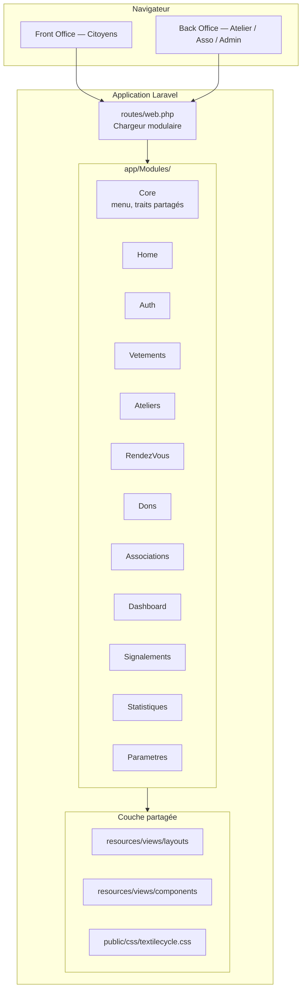
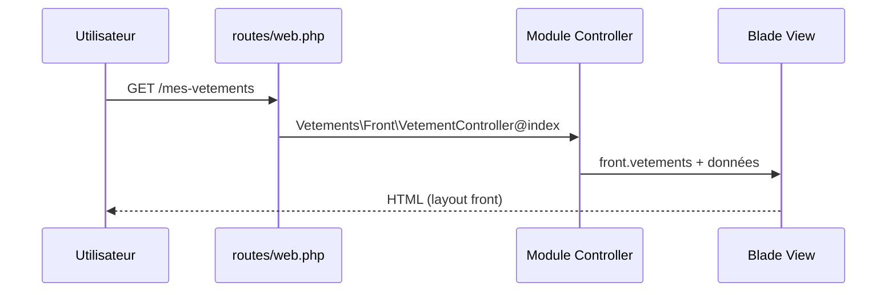
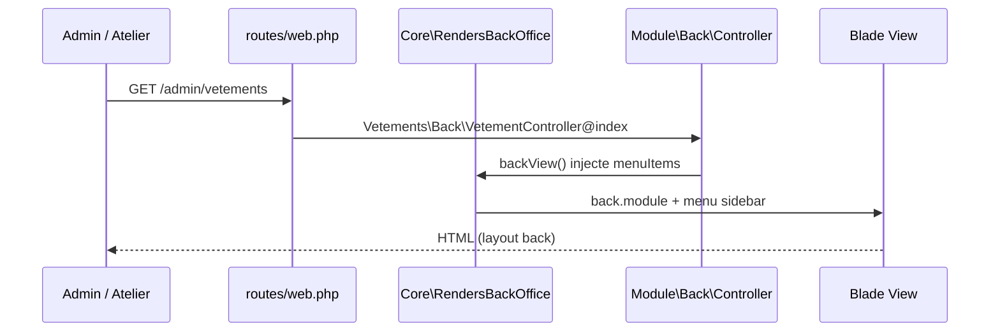

# Architecture TexTileCycle — Laravel 9 (modulaire)

Plateforme d'économie circulaire textile. Architecture **modulaire par domaine métier** pour permettre le travail collaboratif en équipe (chaque développeur / binôme possède un module).

---

## 1. Vue d'ensemble (maille architecturale)



---

## 2. Deux interfaces, un design system

| Zone | URL | Layout | Public |
|------|-----|--------|--------|
| **Front Office** | `/`, `/mes-vetements`, … | `layouts/front.blade.php` | Citoyens |
| **Back Office** | `/admin/*` | `layouts/back.blade.php` | Ateliers, associations, admin |

Identité visuelle commune : vert `#2E7D32`, composants Blade réutilisables (`components/*`).

---

## 3. Structure d'un module (convention équipe)

Chaque module vit dans `app/Modules/{NomModule}/` :

```
app/Modules/Vetements/
├── Http/
│   └── Controllers/
│       ├── Front/          ← pages citoyens
│       └── Back/           ← pages admin
├── Routes/
│   ├── front.php           ← enregistré sous prefix name front.*
│   └── back.php            ← enregistré sous /admin + name back.*
├── Models/                 ← (à venir) Eloquent du domaine
├── Services/               ← (à venir) logique métier
├── Requests/               ← (à venir) validation FormRequest
└── README.md               ← (recommandé) responsable + périmètre
```

**Règle d'or :** un développeur ne modifie **que son module** (+ `Core` ou composants partagés après revue).

---

## 4. Cartographie des modules

| Module | Responsabilité | Front | Back | Routes nommées |
|--------|----------------|-------|------|----------------|
| **Core** | Menu back, traits partagés | — | — | — |
| **Home** | Landing page | ✓ | — | `front.home` |
| **Auth** | Connexion / inscription | ✓ | — | `front.login`, `front.register` |
| **Vetements** | Cycle de vie textile | ✓ | ✓ | `front.vetements`, `back.vetements` |
| **Ateliers** | Carte & CRUD ateliers | ✓ | ✓ | `front.ateliers`, `back.ateliers` |
| **RendezVous** | Prise de RDV & planning | ✓ | ✓ | `front.rdv`, `back.rdv` |
| **Dons** | Proposer / gérer dons | ✓ | ✓ | `front.dons`, `back.dons` |
| **Associations** | Liste & gestion asso | ✓ | ✓ | `front.associations`, `back.associations` |
| **Dashboard** | KPI & activité | — | ✓ | `back.dashboard` |
| **Signalements** | Modération admin | — | ✓ | `back.signalements` |
| **Statistiques** | Impact écologique | — | ✓ | `back.statistiques` |
| **Parametres** | Configuration compte | — | ✓ | `back.parametres` |

---

## 5. Flux de requête HTTP





---

## 6. Arborescence projet complète

```
plateforme-tex-tile-cycle/
├── app/
│   ├── Http/Controllers/Controller.php    ← contrôleur de base Laravel
│   ├── Models/User.php
│   └── Modules/                           ← ★ CODE MÉTIER PAR ÉQUIPE
│       ├── Core/
│       ├── Home/
│       ├── Auth/
│       ├── Vetements/
│       ├── Ateliers/
│       ├── RendezVous/
│       ├── Dons/
│       ├── Associations/
│       ├── Dashboard/
│       ├── Signalements/
│       ├── Statistiques/
│       └── Parametres/
├── routes/
│   ├── web.php                            ← chargeur auto des modules
│   └── api.php
├── resources/views/
│   ├── layouts/                           ← layouts globaux (ne pas dupliquer)
│   ├── components/                        ← design system partagé
│   ├── front/                             ← vues front (migration progressive → modules)
│   └── back/                              ← vues back
├── public/css/textilecycle.css            ← styles globaux
├── database/migrations/                   ← migrations globales (+ par module plus tard)
└── docs/ARCHITECTURE.md                   ← ce fichier
```

---

## 7. Travail collaboratif — guide équipe

### Attribution recommandée (exemple 4 devs)

| Dev | Module(s) | Branche Git suggérée |
|-----|-----------|----------------------|
| Dev A | Home + Auth | `feature/module-home-auth` |
| Dev B | Vetements + Dons | `feature/module-vetements-dons` |
| Dev C | Ateliers + RendezVous | `feature/module-ateliers-rdv` |
| Dev D | Dashboard + Statistiques + Signalements | `feature/module-admin` |

### Ajouter un nouveau module

1. Créer le dossier `app/Modules/MonModule/`
2. Ajouter `Routes/front.php` et/ou `Routes/back.php`
3. Créer les contrôleurs dans `Http/Controllers/Front/` ou `Back/`
4. **Aucune modification de `routes/web.php` nécessaire** — chargement automatique via `glob()`
5. Ajouter les vues dans `resources/views/front/` ou `back/` (ou `resources/views/modules/monmodule/` à terme)
6. Documenter le module dans un `README.md` local

### Contrôleurs Back Office

Utiliser le trait partagé pour injecter le menu sidebar :

```php
use App\Modules\Core\Http\Controllers\Concerns\RendersBackOffice;

class MonController extends Controller
{
    use RendersBackOffice;

    public function index()
    {
        return $this->backView('back.module', ['pageTitle' => 'Mon module']);
    }
}
```

### Évolutions prévues par module

| Couche | Emplacement | Quand |
|--------|-------------|-------|
| Modèles Eloquent | `Modules/X/Models/` | Connexion BDD |
| Services métier | `Modules/X/Services/` | Logique complexe |
| Form Requests | `Modules/X/Http/Requests/` | Validation POST |
| Migrations | `Modules/X/Database/Migrations/` | Schéma par domaine |
| Tests | `tests/Modules/X/` | Tests unitaires / feature |

---

## 8. Stack technique

- **Framework :** Laravel 9 + PHP 8+
- **Vues :** Blade
- **Auth :** Laravel Sanctum (prévu)
- **Langue :** Français
- **CSS :** `public/css/textilecycle.css` (design system green-tech)

---

## 9. Commandes utiles

```bash
# Lister toutes les routes modulaires
php artisan route:list

# Vider le cache routes après ajout de module
php artisan route:clear

# Regénérer l'autoload Composer
composer dump-autoload
```

---

## 10. Prochaines étapes recommandées

1. Migrer les vues vers `resources/views/modules/{module}/` (optionnel)
2. Ajouter les modèles Eloquent par module (Vetement, Atelier, Don, Rdv…)
3. Middleware `auth` + rôles (citoyen, atelier, association, admin)
4. API REST par module dans `Routes/api.php` si besoin mobile
